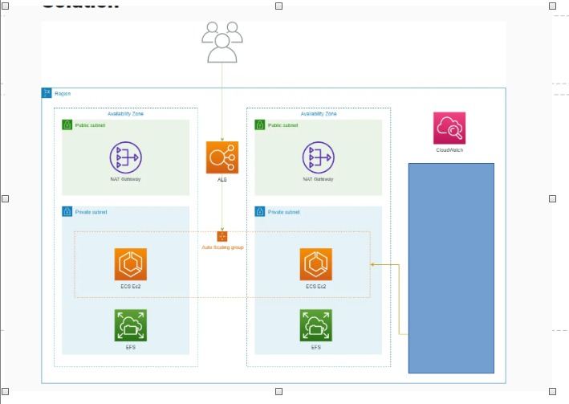
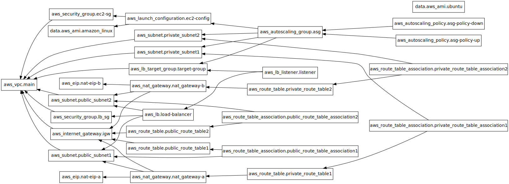

# AWS Provisioning with Terraform

## Project Aim

The aim of this project is to automate the provisioning of AWS infrastructure using Terraform. This includes setting up VPCs, subnets, security groups, EC2 instances, and other AWS resources in a consistent and repeatable manner.

## Architecture



## Steps to Provision AWS Infrastructure

1. **Install Terraform**: Ensure that Terraform is installed on your local machine. You can download it from the [official Terraform website](https://www.terraform.io/downloads.html).

2. **Configure AWS CLI**: Set up the AWS CLI with your credentials. You can follow the instructions [here](https://docs.aws.amazon.com/cli/latest/userguide/cli-configure-quickstart.html).

3. **Clone the Repository**: Clone this repository to your local machine.
    ```sh
    git clone https://github.com/yourusername/aws-provisioning-with-terraform.git
    cd aws-provisioning-with-terraform
    ```

4. **Initialize Terraform**: Initialize the Terraform configuration.
    ```sh
    terraform init
    ```

5. **Plan the Infrastructure**: Generate and review the execution plan.
    ```sh
    terraform plan
    ```

6. **Apply the Configuration**: Apply the Terraform configuration to provision the infrastructure.
    ```sh
    terraform apply
    ```

7. **Verify the Infrastructure**: Verify that the infrastructure has been provisioned correctly by logging into the AWS Management Console.

## Graph



## Cleanup

To destroy the infrastructure and avoid incurring costs, run:
```sh
terraform destroy
```

## Contributing

Contributions are welcome! Please fork the repository and submit a pull request.

## License

This project is licensed under the MIT License. See the [LICENSE](LICENSE) file for details.

## Services Used

This project utilizes several AWS services to ensure high availability and scalability of the application hosting Apache:

- **Auto Scaling**: Automatically adjusts the number of EC2 instances to handle the load on your application.
- **Elastic Load Balancer (ELB)**: Distributes incoming traffic across multiple EC2 instances to ensure no single instance is overwhelmed.
- **NAT Gateway**: Allows instances in a private subnet to connect to the internet or other AWS services while preventing the internet from initiating connections with those instances.
- **VPC (Virtual Private Cloud)**: Provides a logically isolated network for your AWS resources.
- **Subnets**: Divides the VPC into smaller network segments.
- **Security Groups**: Acts as a virtual firewall to control inbound and outbound traffic for your instances.
- **EC2 Instances**: Virtual servers to run your applications.

These services work together to create a highly available and scalable environment for hosting the Apache web server.
